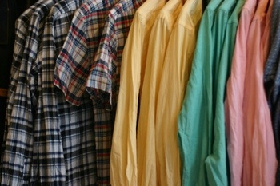

# onlineshopping
This Project is online product to purchaes easily...
<!DOCTYPE html>
<html dir="ltr" lang="en-US"><head><!-- Created by Artisteer v4.1.0.59861 -->
    <meta charset="utf-8">
    <title>Main</title>
    <meta name="viewport" content="initial-scale = 1.0, maximum-scale = 1.0, user-scalable = no, width = device-width">

    <!--[if lt IE 9]><![endif]-->
    <link rel="stylesheet" href="style.css" media="screen">
    <!--[if lte IE 7]><link rel="stylesheet" href="style.ie7.css" media="screen" /><![endif]-->
    <link rel="stylesheet" href="style.responsive.css" media="all">
<link rel="stylesheet" type="text/css" href="http://fonts.googleapis.com/css?family=Gentium+Basic&amp;subset=latin">
<link rel="shortcut icon" href="favicon.ico" type="image/x-icon">
    
    
    
<meta name="description" content="veejaygarments is wholeseller in mumbai">
<meta name="keywords" content="veejaygarments, veejay garments, mumbai garments">

</head>
<body>

<header class="htl-header">

    

    

    

            

                
                    
</header>

            

                

                    

                        

        

<ul class="htl-vmenu"><li><a href="main.html" class="active">Main</a></li><li><a href="about-us.html">About Us</a></li><li><a href="catalog.html">Catalog</a><ul><li><a href="catalog/mens-wear.html">Men's Wear</a></li><li><a href="catalog/mens-denim-jeans.html">Men's Denim Jeans</a></li><li><a href="catalog/mens-cotton.html">Men's Cotton</a></li><li><a href="catalog/mens-formal.html">Men's Formal</a></li><li><a href="catalog/payment-options.html">Payment Options</a></li></ul></li><li><a href="home.html">News</a></li><li><a href="pricing.html">Pricing</a></li><li><a href="testimonials.html">Testimonials</a></li><li><a href="contacts.html">Contact Us</a></li></ul>
                
        

        

<a href="/catalog/mens-jeans">50% OFF JEANS!</a>
 

Yppee offer valid for short period only......
 

<a href="catalog/mens-denim-jeans.html">Click Here</a> 
 to check out our special deal!

                        
<article class="htl-post htl-article">
                                
                                                
                

    

    

        
    

        <blockquote style="text-align: left;">We delight our customers with our products and service, and always make them feel that they are getting great value for their money.To design, make and sell products with intrinsic worth that comes from the original designs, knowledge, care and skill with which these are made.</blockquote>
    

    

    

    

        <h3>Website Updates</h3><ul style="margin-top: 1em; margin-bottom: 1em; margin-left: 2em;"><li><a href="catalog/mens-wear.html">"Vain Glory"</a></li><li><a href="catalog/mens-denim-jeans.html">&nbsp;Men's Denim</a></li><li><a href="catalog/mens-cotton.html">Men's Cotton</a></li><li><a href="catalog/mens-cotton.html">Men's Formals</a></li><li>New Arrivals!! To be true to our commitment and history as an ethical and trust-worthy brand promoting a stake-holder based community model of inclusive capitalism.To constantly share our Vision with our employees, suppliers, business associates and customers, so that we collectively ensure that all our actions are in service of our Vision, Mission and Guiding Principles. 
        </li>
        </ul>
    

        <h3>Collection Updates</h3>

    

    

    

        
         
         
        
 

    

    

                                
                

</article>

                    

                

            
<footer class="htl-footer">

Copyright © 2014. 
veejaygarments. All Rights Reserved.

</footer>

    

    

        Designed by <a href="http://www.htlwebs.com" target="_blank">Ravi Parmar</a>.
    

</body></html>
